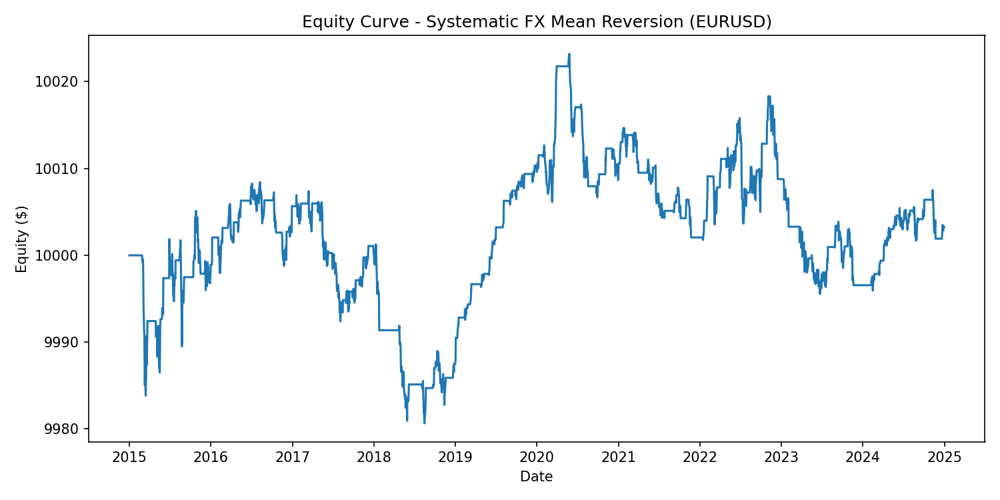

# Systematic FX Mean Reversion Model

This project implements a complete systematic trading framework applied to EUR/USD daily data from 2015 to 2024.  
The objective is to design a transparent, interpretable and risk-controlled strategy, following the research principles adopted in quantitative asset management.  
The focus is not on maximizing returns, but on building a clean model, understanding its behaviour and documenting its limitations.

---

## 1. Overview

The work covers all essential components of a quantitative trading pipeline:  
data retrieval, preprocessing, signal construction, volatility-adjusted risk management, position sizing, backtesting and performance evaluation.

All data are sourced from Yahoo Finance through `yfinance`, and the strategy is implemented and tested using `backtesting.py`.  
The full framework is contained in a single Python script for clarity and reproducibility.

---

## 2. Strategy Design

The strategy is based on a simple mean-reversion mechanism.  
The model computes a rolling mean and standard deviation of closing prices and defines upper and lower bands.  
When price deviates excessively below the lower band, a long position is opened; when it exceeds the upper band, a short position is taken.  
Positions are closed once price reverts to the mean.

The intent is to capture temporary dislocations without resorting to forecasting or complex optimisation.

---

## 3. Risk Management

The risk framework is central to the strategy and includes:

- ATR-based stop-losses, which adjust automatically to changes in volatility  
- fractional position sizing, ensuring consistent risk exposure across trades  
- portfolio-level drawdown control, which halts trading if cumulative losses exceed a predefined threshold  
- removal of abnormal price spikes (>10%) to preserve data quality

This allows the strategy to behave in a stable and controlled manner even under varying market conditions.

---

## 4. Backtesting Framework

The backtesting environment handles position management, order execution, commission modelling, drawdown analysis and summary statistics.  
The backtest is run on the full sample (2015–2024) with no parameter optimisation beyond the initial specification.

Below is the equity curve generated by the backtest:

(Ensure that `equity_curve.png` is present in the repository.)

---

## 5. Performance Summary (2015–2024)

The strategy generates a stable equity profile with very limited drawdowns and a small positive return over nearly ten years.  
This result is consistent with the high level of efficiency in major FX markets, where simple mean-reversion signals rarely yield strong and persistent excess returns.

Typical results on the baseline configuration:

- Total return approximately 0.03%  
- CAGR close to zero  
- Maximum drawdown around 0.3%  
- Win rate around 65%  
- Expectancy slightly positive  
- Very low annualised volatility  

The emphasis is on robustness and transparency rather than return optimisation.

---

## 6. Interpretation

The conclusions from the study align with established findings in FX microstructure research:  
predictability in daily EUR/USD is limited, and excess returns require either more complex signals or regime-specific modelling.  
The strategy does not rely on curve-fitting and remains stable under realistic market conditions, making it a credible baseline for further extensions.
